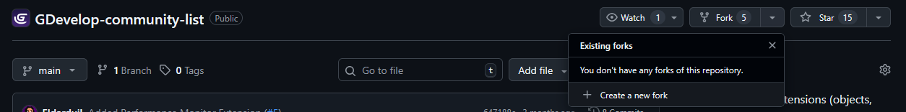
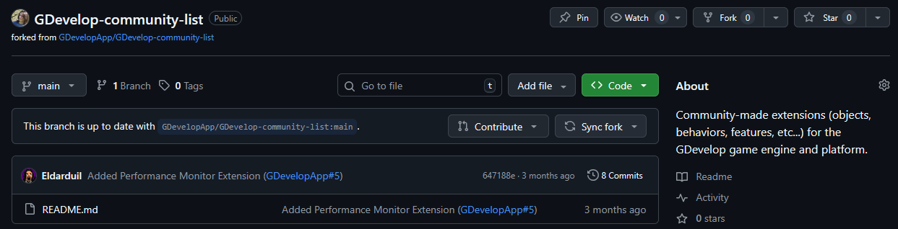
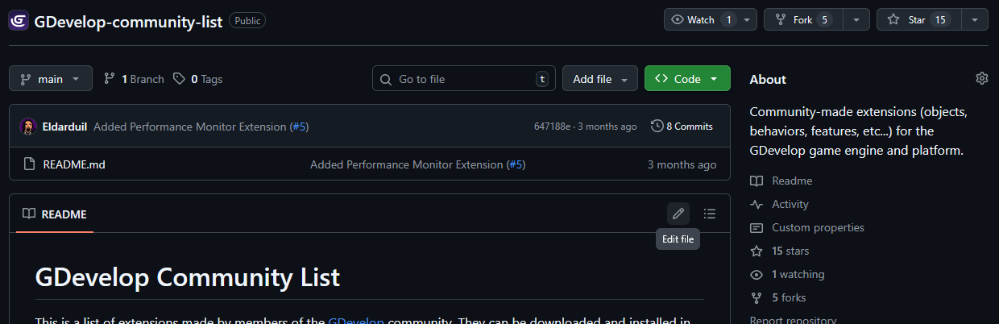
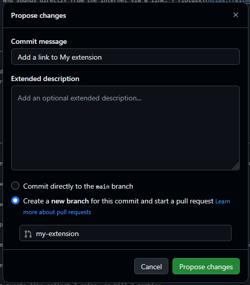
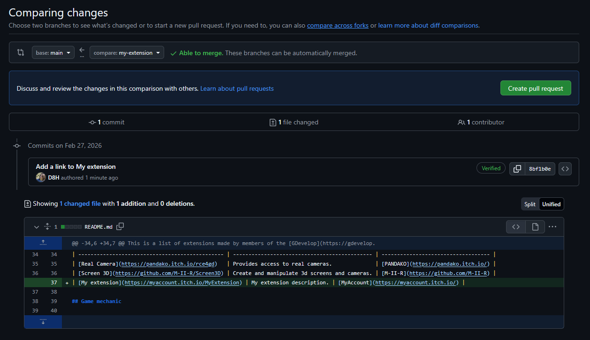
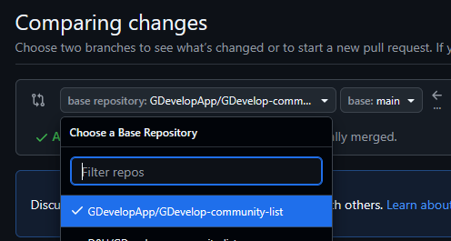

# Submit a link to your extension

## Create your own copy of the list

This step is only necessary for your first submission.

- Click on the **Fork** button in the top right corner
- Choose **Create a new fork**



[Learn more about forks...](https://docs.github.com/en/pull-requests/collaborating-with-pull-requests/working-with-forks/fork-a-repo)

## Make an old copy of the list up to date

This step is only necessary for your following submissions.

- Click on the **Sync fork** button



[Learn more about syncing forks...](https://docs.github.com/en/pull-requests/collaborating-with-pull-requests/working-with-forks/syncing-a-fork)

## Add the link to your own copy

- Click on the **Edit file** with the pencil icon



- Add a row in the table

It should look like this:
```
| [My extension](https://myaccount.itch.io/MyExtension) | My extension description. | [MyAccount](https://myaccount.itch.io/) |
```

- Click on the **Preview** button to check your changes
- Click on the **Commit changes** to save your changes

This dialog should open:



- Choose **Create a new branch**
- Click on the **Propose changes** button

[Learn more about file edition...](https://docs.github.com/en/repositories/working-with-files/managing-files/editing-files)

## Submit your changes

- Click on the **compare across forks** link in the top of the page



- You can now choose to submit your changes to GDevelop’s community list
- Click on the **Create pull request** button in the top right corner



[Learn more about pull requests...](https://docs.github.com/en/pull-requests/collaborating-with-pull-requests/proposing-changes-to-your-work-with-pull-requests/creating-a-pull-request-from-a-fork)
